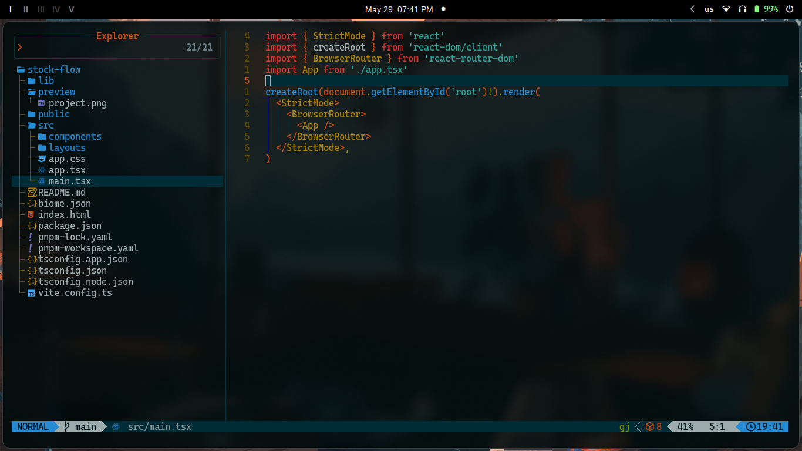

# Índice rápido

1. [stock-flow](#stock-flow)
2. [Stack](#stack)
3. [Diseño de UI](#diseño-de-ui)
4. [Backlog](#backlog)
5. [Estructura del proyecto](#estructura-del-proyecto)
6. [Ejecución local del proyecto](#ejecución-local-del-proyecto)
   * Requisitos
   * Clonar el repositorio
   * Instalar dependencias
   * Inicializar Stock Flow
7. [Flujo de trabajo](#flujo-de-trabajo)
   * Mantener tu rama actualizada
   * Verificar la rama correcta
   * Comprobación con Biome
   * Guardar cambios y crear commits
   * Subir cambios
   * Ramas del proyecto
8. [Navegación entre páginas](#navegación-entre-páginas)
   * useNavigate
   * Componente Link

---

# stock-flow

**Proyecto | Desarrollo de Software III**



## Stack

Este proyecto está construido con las siguientes tecnologías:

- **Vite** — Herramienta de desarrollo y empaquetado rápida para aplicaciones modernas.
- **React** — Biblioteca para la construcción de interfaces de usuario.
- **Tailwind CSS** — Framework de utilidades para estilos rápidos y consistentes.
- **CSS Modules** — Estilos encapsulados por componente para mantener una mejor organización y evitar conflictos de clases.

## Diseño de UI

Propuesta de diseño disponible en [Stitch](https://stitch.withgoogle.com/projects/10518011282484899449)

## Backlog

Organización de historias y subtareas en [Jira](https://www.atlassian.com/es/software/jira)

## Estructura del proyecto

```bash
stock-flow/
├── lib/
│   ├── api/        # Servicios de API y manejo de solicitudes
│   ├── constants/  # Constantes globales, enums y valores de configuración
│   ├── types/      # Interfaces y tipos compartidos de TypeScript
│   └── utils/      # Funciones auxiliares y utilitarias
│
├── public/         # Recursos estáticos servidos directamente por Vite
│
├── src/
│   ├── assets/          # Recursos estáticos de la aplicación
│   │   └── icons.tsx    # Exportación y centralización de iconos reutilizables
│   │
│   ├── components/
│   │   ├── auth/        # Componentes relacionados con el login
│   │   ├── categories/  # Componentes relacionados con categorías
│   │   ├── dashboard/   # Widgets, gráficos y componentes de resumen del dashboard
│   │   ├── movements/   # Componentes de movimientos de inventario (entradas, salidas y ajustes)
│   │   ├── products/    # Componentes de gestión de productos
│   │   ├── sales/       # Componentes relacionados con ventas
│   │   ├── sidebar/     # Menú lateral de navegación de la aplicación
│   │   └── ui/          # Componentes reutilizables de UI (botones, tablas, modales, inputs, etc.)
│   │
│   ├── layouts/         # Layouts reutilizables de la aplicación
│   │
│   ├── pages/               # Vistas principales asociadas a las rutas de la aplicación
│   │   ├── auth.tsx         # Inicio de sesión
│   │   ├── categories.tsx   # Categorías
│   │   ├── dashboard.tsx    # Dashboard
│   │   ├── movements.tsx    # Movimientos de inventario
│   │   ├── products.tsx     # Productos
│   │   └── sales.tsx        # Ventas
│   │
│   ├── app.css      # Estilos globales de la aplicación
│   ├── app.tsx      # Componente raíz de la aplicación
│   └── main.tsx     # Punto de entrada de la aplicación
│
├── README.md            # Documentación e instrucciones de configuración
├── biome.json           # Configuración de Biome (formatter, linter y reglas de calidad)
├── index.html           # Archivo HTML principal utilizado por Vite
├── package.json         # Dependencias, scripts y metadatos del proyecto
├── pnpm-lock.yaml       # Versiones bloqueadas para instalaciones reproducibles
├── tsconfig.app.json    # Configuración de TypeScript para el código de la aplicación
├── tsconfig.json        # Configuración base compartida de TypeScript
├── tsconfig.node.json   # Configuración de TypeScript para Node.js y Vite
└── vite.config.ts       # Configuración de Vite (plugins, alias, build y servidor de desarrollo)
```

---

# Ejecución local del proyecto

## Requisitos

* [Node.js](https://nodejs.org/en)
* [pnpm](https://pnpm.io/) *(Opcional, pero recomendado)*. Instálalo con:

```bash
npm install -g pnpm
```

## Clonar el repositorio

```bash
git clone https://github.com/dilanrojas/stock-flow
cd stock-flow
```

## Instalar dependencias

### Usando npm

```bash
npm install
```

### Usando pnpm (recomendado)

```bash
pnpm install
```

## Inicializar Stock Flow

```bash
pnpm run dev
```

---

# Flujo de trabajo


## Variables de entorno

Stock Flow utiliza el archivo `.env` para conectarse, entre otras cosas, a la API.

Añade las siguientes variables a dicho archivo:
  - VITE_API_URL

## Mantén tu rama actualizada

Antes de comenzar cualquier tarea, verifica que tu rama esté actualizada para evitar conflictos al hacer commits.

### Cambiar a la rama de desarrollo

```git
git checkout development
```

### Descargar cambios recientes

```git
git pull
```

### Volver a tu rama

```git
git checkout feat/{nombre}
```

### Fusionar cambios de desarrollo

```git
git merge development
```

### Subir los cambios

```git
git push
```

---

## Verifica que estás en la rama correcta

Comprueba tu rama actual con:

```git
git branch
```

Debe mostrar tu rama `feat/{nombre}` marcada con `*`, por ejemplo:

```git
* feat/{nombre}
```

Si no estás en tu rama:

```git
git checkout feat/{nombre}
```

Ejecuta nuevamente:

```git
git branch
```

Si aparece la rama correcta marcada con `*`, ya puedes continuar trabajando.

---

## Comprobación con Biome

Antes de crear un commit, asegúrate de que el código cumpla con las reglas de formato y calidad definidas por Biome.

### Verificar el proyecto

```bash
pnpm biome check .
```

### Corregir problemas automáticamente

```bash
pnpm biome check --write .
```

Ejecuta estos comandos antes de cada commit para mantener un estilo de código consistente y una buena calidad en todo el proyecto.

---

## Guardar cambios y crear un commit

### Agregar todos los cambios

```git
git add .
```

### Crear un commit

Especifica el tipo de cambio realizado (`feat`, `fix`, `ui`, `docs`, etc.):

```git
git commit -m "feat | fix | ui: {descripción}"
```

---

## Subir tus cambios

Asegúrate de estar en tu rama antes de enviarlos:

```git
git push
```

---

## Ramas del proyecto

Como referencia, estas son las ramas principales:

```git
* main          # Rama de producción
  development   # Rama de pruebas antes de fusionar a main
  feat/dilan    # Rama de Dilan
  feat/angely   # Rama de Angely
  feat/esteban  # Rama de Esteban
  feat/amanda   # Rama de Amanda
```

---

# Navegación entre páginas

## useNavigate (hook de React)

`useNavigate` se utiliza cuando la navegación depende de lógica personalizada (inicio de sesión, validaciones, permisos, etc.).

```jsx
import { useNavigate } from "react-router-dom";

export default function UsageExample() {
  const navigate = useNavigate();

  const handleClick = () => {
    if (condition) {
      navigate("/home"); // redirige
    } else {
      alert("Condición no cumplida");
    }
  };

  return (
    <h1>Contenido de la página</h1>
  );
}
```

---

## Componente Link

`Link` se utiliza para la navegación iniciada por el usuario (menús, botones, barra de navegación, etc.).

```jsx
import { Link } from "react-router-dom";

export default function UsageExample() {
  return (
    <header>
      <nav>
        <ul>
          <li>
            <Link to="/products">
              Productos
            </Link> {/* Redirige a /products según lo definido en <Routes /> */}

            <Link to="/profile">
              Mi perfil
            </Link>
          </li>
        </ul>
      </nav>
    </header>
  );
}
```

---

>[!NOTE]
> Se recomienda seguir siempre el flujo: actualizar la rama → desarrollar → ejecutar Biome → crear commit → hacer push. Esto ayuda a mantener el repositorio organizado y reduce conflictos al integrar cambios.
